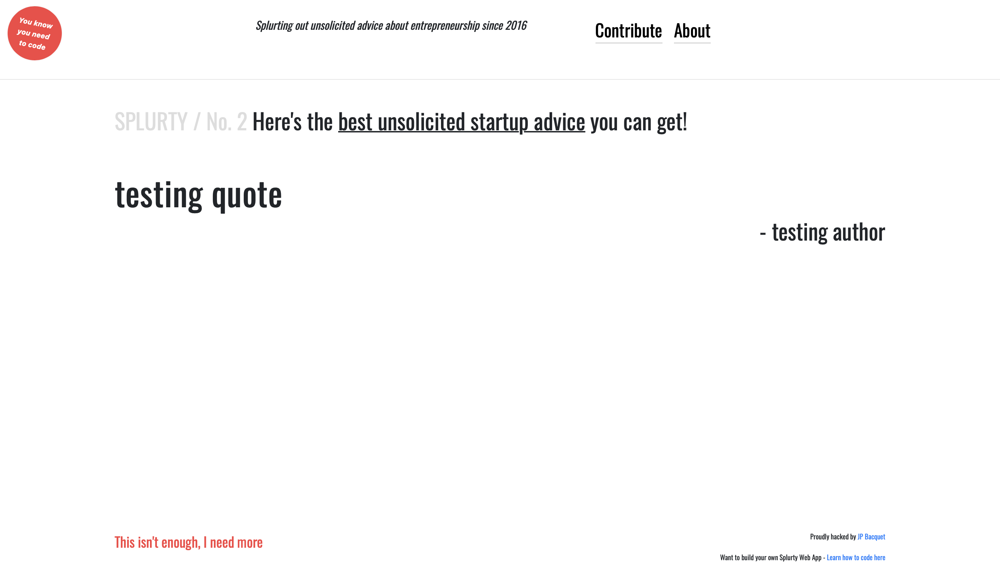

# Splurty - Quote Generator

My first assignemnt while enrolled in the UCF Full Stack Web Development Boot Camp.  This app 
allows users to add quotes that will be randomly displayed in the main page. A database-powered quote generator with a monile-first design, using the Ruby on Rails framework, HTML, and CSS. Uses Git and GitHub for version control, and launched on Heroku.

Preview:
https://splurty-jp-bacquet.herokuapp.com

## Features
* [Ruby on Rails](https://guides.rubyonrails.org/) - The web framework used.
* Mobile-responsive.
* Crowd-source content.

## Authors
* **Jean-Pol Bacquet** - *Assignment from UCF Web Boot Camp* - [Splurty - Quote Generator](https://github.com/jeanpolbac/jpbootcamp)

## Credits
* [UCF - Coding Bootcamp](https://bootcamp.ce.ucf.edu/coding/)
